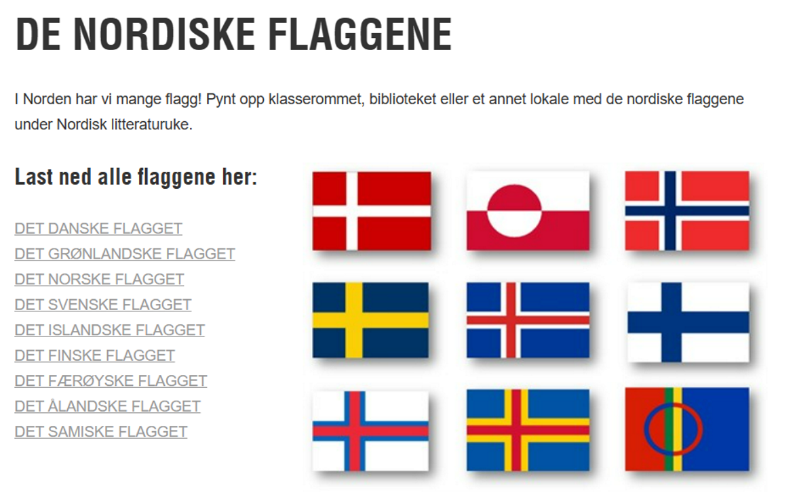

# Oppgave – tegne flagg med Python og Turtle

## Mål

I denne oppgaven skal du bruke Python-biblioteket Turtle til å tegne minst tre av de nordiske flaggene.

Hvert flagg skal tegnes i et eget Python-skript.'

> Se turlte intro: [Turtle Intro](../docs/turtle-intro.md)

## Krav

- Bruk Python og Turtle-biblioteket til å løse oppgaven.
- Tegn minst tre nordiske flagg.
- Hvert flagg skal tegnes i et eget Python-skript.
- Flagget skal være gjenkjennbart.
- Fargene skal være så nøyaktige som mulig.
- Koden skal være godt kommentert, slik at det er enkelt å forstå hva hver del gjør.

## Valgfrie ekstraoppgaver

- Legg til funksjonalitet som lar brukeren velge hvilket flagg som skal tegnes.
- Bruk funksjoner for å redusere kodegjentakelse.
- Legg til en funksjon som automatisk kan skalere flagget til forskjellige størrelser.

