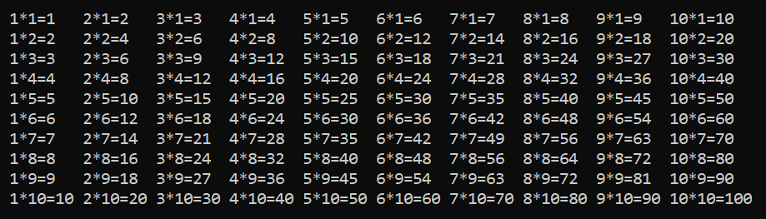

# Gangetabell

## Lag et program som skriver ut gangetabellen fra 1 til 10.

Eksempel:

> **Tips:** Her er det lurt å bruke to for-løkker. Bruk én løkke til å kontrollere det første tallet og en annen løkke til å kontrollere det andre tallet.