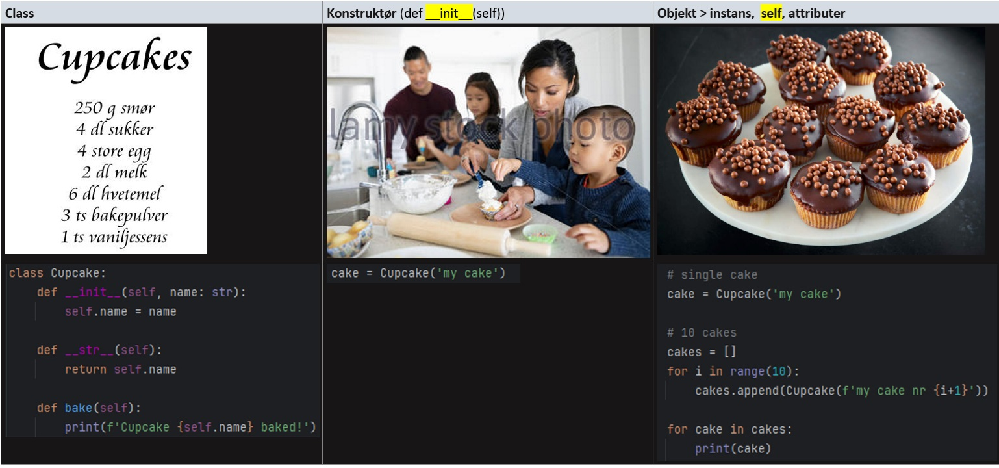

# Objektorientert programmering (OOP) – Oversikt

Objektorientert programmering (OOP) er en måte å organisere kode på ved hjelp av **klasser og objekter**. En klasse beskriver hvilke egenskaper (attributter) og handlinger (metoder) objektene skal ha.

OOP bygger på fire grunnleggende prinsipper. I tillegg finnes det flere konsepter som beskriver relasjoner mellom klasser og hvordan vi lager en god programstruktur.

## De fire grunnleggende prinsippene

| Prinsipp | Forklaring |
|---|---|
| **Innkapsling (Encapsulation)** | Samler data og metoder i en klasse og kontrollerer hvordan objektets interne data kan leses og endres. |
| **Arv (Inheritance)** | Lar en underklasse arve attributter og metoder fra en overklasse. Brukes når det finnes en naturlig *er en*-relasjon, for eksempel at en bil er et kjøretøy. |
| **Polymorfisme (Polymorphism)** | Gjør det mulig å bruke samme metode eller grensesnitt på forskjellige objekter, selv om objektene utfører handlingen på ulike måter. |
| **Abstraksjon (Abstraction)** | Skjuler unødvendige implementasjonsdetaljer og viser bare det brukeren trenger å vite. Fokuserer på *hva* et objekt gjør, fremfor *hvordan*. |

## Tilknyttede konsepter

| Konsept | Forklaring |
|---|---|
| **Assosiasjon (Association)** | En relasjon mellom objekter, for eksempel at en lærer underviser en student. |
| **Aggregering (Aggregation)** | En svak *har en*-relasjon der delene kan eksistere uavhengig av helheten. Eksempel: Et lag har spillere. |
| **Komposisjon (Composition)** | En sterk *har en*-relasjon der delene er tett knyttet til helhetens eierskap og livssyklus. Eksempel: En ordre består av ordrelinjer. |
| **Kobling (Coupling)** | Beskriver hvor avhengige klasser er av hverandre. **Lav kobling** gjør det enklere å endre og teste kode. |
| **Kohesjon (Cohesion)** | Beskriver hvor godt funksjonaliteten i en klasse hører sammen. **Høy kohesjon** betyr at klassen har et tydelig ansvarsområde. |

**Husk:** Arv beskriver en *er en*-relasjon, mens aggregering og komposisjon beskriver *har en*-relasjoner.

---

